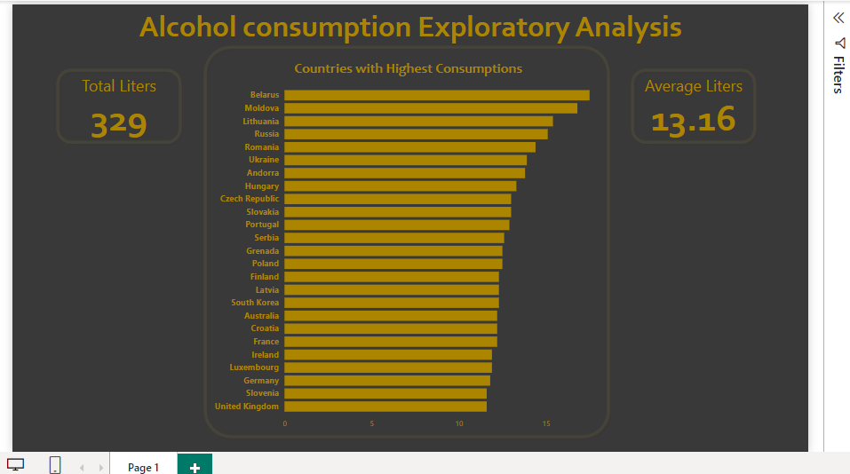

# Alcohol-consumption-PowerBI-modified.

This project was visualized using PowerBI. 

I have a more detailed explanation of this project in [Alcohol Consumption by Country](https://github.com/Mich-Martins/Alcohol_consumption_by_country)
However, This visualization explains more on the total liters of alcohol consumed by the countries and the average liters consumed by each country.
